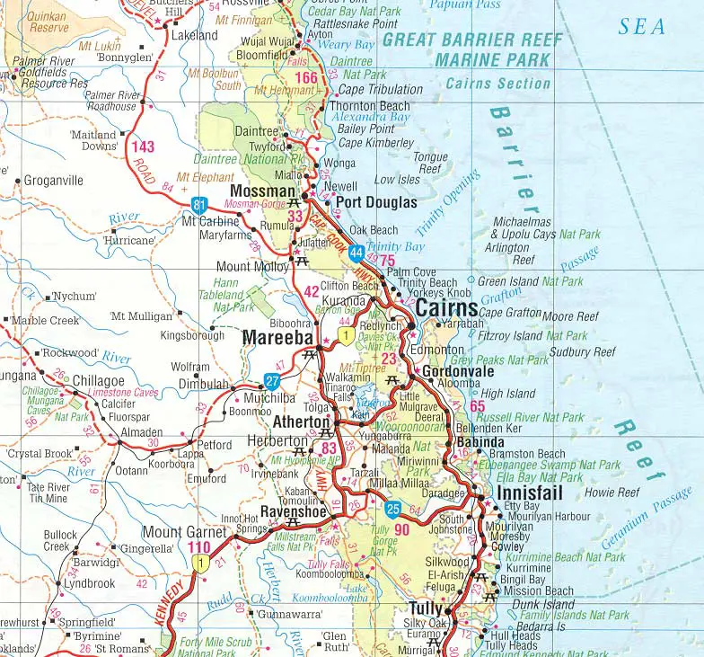

#Australia
https://www.bing.com/images/search?view=detailV2&ccid=L%2b1I4Q6l&id=BB7E97A629DC463468E4B183F1CFCD39E8140415&thid=OIP.L-1I4Q6lvWjU1N0TzmnUCgHaG5&mediaurl=https%3a%2f%2fwww.mapsof.net%2fuploads%2fstatic-maps%2fmap_of_Cairns.jpg&exph=731&expw=784&q=%e3%82%b1%e3%82%a2%e3%83%b3%e3%82%ba+%e3%83%9e%e3%83%83%e3%83%97&simid=608040337408088745&FORM=IRPRST&ck=771737358D07B9B9B4687C2BAD09E0AE&selectedIndex=38&ajaxhist=0&ajaxserp=0

This is Australia's Cairns map.

The map have a lot of letter,some park name and maybe train's line.

I want to travel Australia so I chose the map.
And I want to see koalas , Cairns have some zoo
can hold koalas !

Good point...
The map use a lot of color so it is interesting.
Having a lot of letter show us there have many sightseen.

Not good point...
I think the map have more space during the letter
because some letter be too close.
